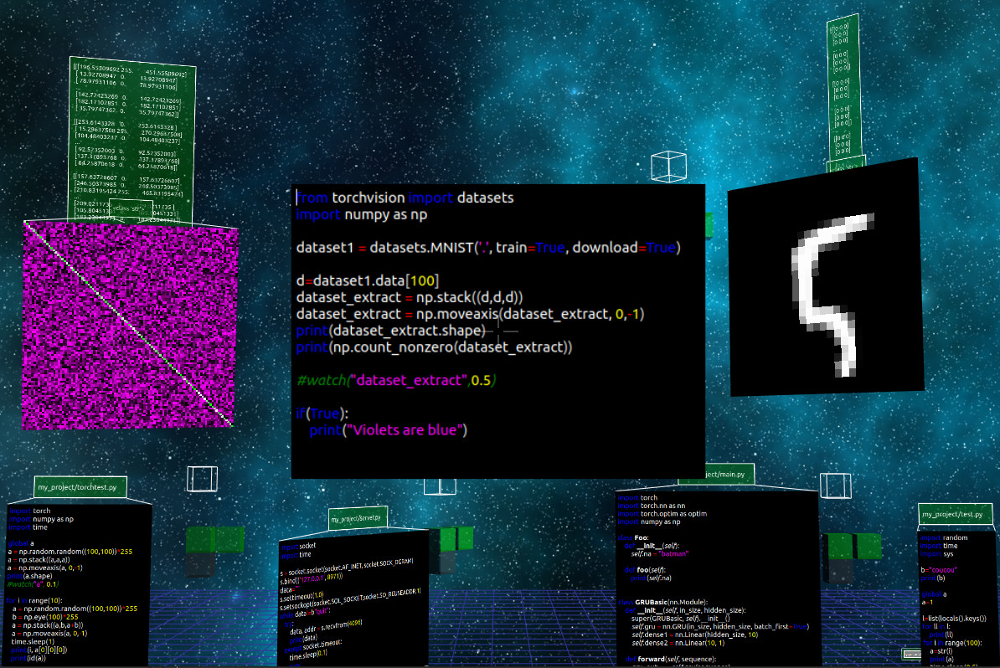

What?
=====

WOL is an IDE in the form of a game-like 3D universe that intends at being actually 
usable and not just a tech demo. 

It is similar in its logic to a set of Jupyter notebooks and aims at adding a few things that I
felt missing from Jupyter: 
- The ability to work on python files as you are working on notebooks
- Having "live" objects refreshed automatically
- Seemless collaboration with others

How?
====

`python client_notebook.py`

This uses Python, OpenGL and Qt. (and pybullet, soon)

Why?
====

This is a Work of Love. Making things I enjoy, curled into my little universe of code.
Starting processes, sharing code with friends, fine-tuning my machines and the little universe
we design together.

I started it because I wanted to make a 3D game that would allow in-game programming collaboratively.

Along the way I realized it would be interesting to use it for exploring and visualizing what
happens in a machine learning model. And as I was looking into reinforcement learning for robotics, 
one thing led to the other I am currently trying to put pybullet in it.

It is a tool to do mostly exploratory programming.

